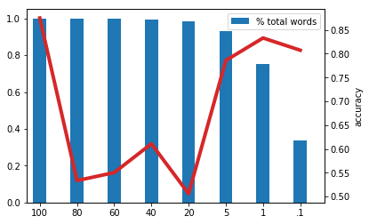

# opendatascience.com

## Three methods of data pre-processing for text classification
As I developer advocate at IBM, I work to empower AI, Machine Learning, and Deep Learning developers to be successful with both open source tools and those found on IBM Cloud. I also like to better my understanding of AI/ML/DL developers by performing deep learning on them. I recently built a [classifier](https://github.com/PubChimps/dlclassifier) to predict a developer's Deep Learning Framework of choice based on the code that they wrote, via examples of TensorFlow and PyTorch projects.

In order to pass code examples through a neural network, some transformations had to be performed to get data in a state that a network could use to classify. There were three techniques that were beneficial for me when developing this project, described below.

### Bag of Words
Modern neural networks cannot interpret labeled text as described above and data must be pre-processed before it can be given to a network for training. One straightforward way to do this is with a bag of words. A bag of words is created by scanning through every element in a data set and creating a dictionary for each unique word seen that can act as an index. For instance, if 'Acosta' is the 1,000th unique word encountered when building a bag of words, every instance of data that has the word 'Acosta' in it will have a non-zero value equivalent to the word's number of apperences in its 1,000th column. This allows a full representation of a data set in a format that a neural network can operate on. However, this can produce quite a large feature vector (in my case 45,818), which will dramatically effect the number of parameters a network has to train on.

### Feature-Vector Length as a Hyperparameter
Keeping each word as a feature in a data set can lead to one that is extremely sparse. Neural networks generally have a harder time optimizing gradients with sparse data and are more likely to over- or underfit a training set. Many data sets comprised of text, including the one reference in this post, closely resemble Zipf's law of distribution, meaning the least frequently referenced words may often only occur one time within a dataset, and can be discarded to provide a dataset that is more dense. This can be done by sort the bag of words generated in the previous section, but only maintain a portion of the most frequently used words. How many words to keep, like the number of layers in a network or number of nodes with a layer, becomes a hyperparameter of the network. Luckily, there are now ways to [automatically perform a hyperparameter optimization process](https://dataplatform.cloud.ibm.com/docs/content/wsj/analyze-data/ml_dlaas_hpo.html).

|  | 
|:--:| 
| *Eliminating the least frequently used words can still alter the effectiveness of a neural network* |

### Embeddings
There is a tradeoff in the first two methods described above between having a full representation of the data via one-hot encoding or having a dense data set by limiting the length of the feature vector. The benefits of both can be had via word embeddings. With respect to this project, embeddings refer the ability to translate data from a real space into an embedded space that is both more dense and trainable. Keras provides a nice API to easily add a word embedding as a first layer in a network via its layers library, an example of how to use it is illustrated below. Like in the previous example, the resulting length of the embedded space is a hyperparameter to be set or found via optimization. 

|  | 
|:--:| 
| *Embedding is easy with Keras and creates a dataset that is more dense and easier to train* |

### Want to get started?
If you would like to try the concepts described here, I will be presenting this material, as well as model building, serving, and deep learning framework selection at [ODSC Europe](https://odsc.com/training/portfolio/choosing-the-right-deep-learning-framework-a-deep-learning-approach/) in London this November at the workshop "Choosing The Right Deep Learning Framework: A Deep Learning Approach," and writing about it on the [IBM Data Science Community](https://www.ibm.com/community/datascience/). 
